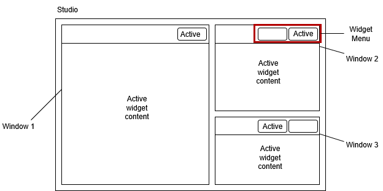

# Studio Doc
Basic overview of studio implementation. Application is a desktop-based IDE running entirely in the browser. UI structure and behaviour inspired by [Leetcode](https://leetcode.com/) IDE.

## Architecture
Main IDE components are:
```typescript
- Studio
- Window
- Widget
- Window Overlay
```

- **Studio**: Top level application environment managing workspace state; coordinates all subsystems - *windows*, *widgets*, etc...
- **Window**: Partition of studio space. Independent, movable and resizable container that stores a selection of widgets. Content displayed by a given window is dependent on which widget is active. 
- **Widget**: Self-contained functional component providing a specific view / capability (e.g. Code editor, Terminal, Basic text box). Widgets are displayed inside windows.

*Example Heirarchy:*
```
Studio
├── Window 1
│   └── Blockly Widget
├── Window 2
│   ├── Terminal Widget
│   └── Code Editor Widget
└── Window 3
    ├── Instructions Widget
    └── Help Menu Widget
```

A good analogy would be a computer running several search engines, each with one or many tabs open.
- **Studio** = your desktop
- **Window** = search engine window
- **Widget** = the tab s open in each window


## Basic UI
Studio UI intended to mimic leetcode website. 

**Intended Layout**
<figure>

</figure>

**Example Implementation**
<figure>

</figure>

## State Management
